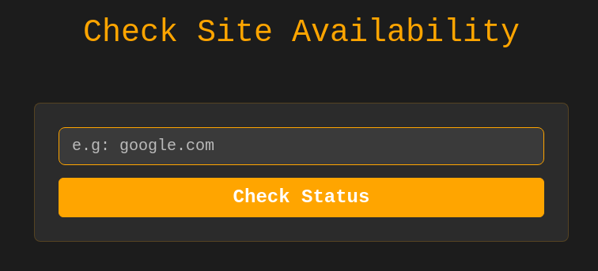
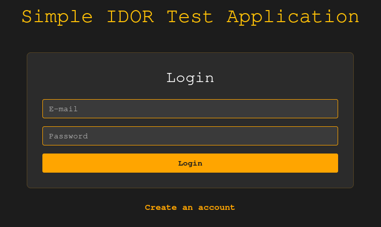
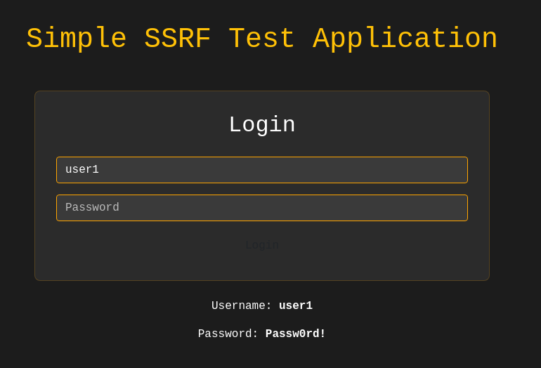

# Vuln Labs
A set of vulnerable Docker hosts built to reflect real world scenarios.

The labs generally focus on one vulnerability, but knowing my coding skills there are probably more unintended ways. 

## DNS Exfil

A short and simple lab built around a tool for checking website status. 

**Goal:** Exfiltrate data from the server, e.g `/etc/passwd`

## Idor

A bit more complex lab (to setup atleast) showcasing what can happen if you expose to much code.

**Goal:** Access another users `access_token`

## SSRF to DNS Rebinding

The user is allowed to upload files by specifying a target URL.

**Goal:** Read content of another users uploaded file(s)
